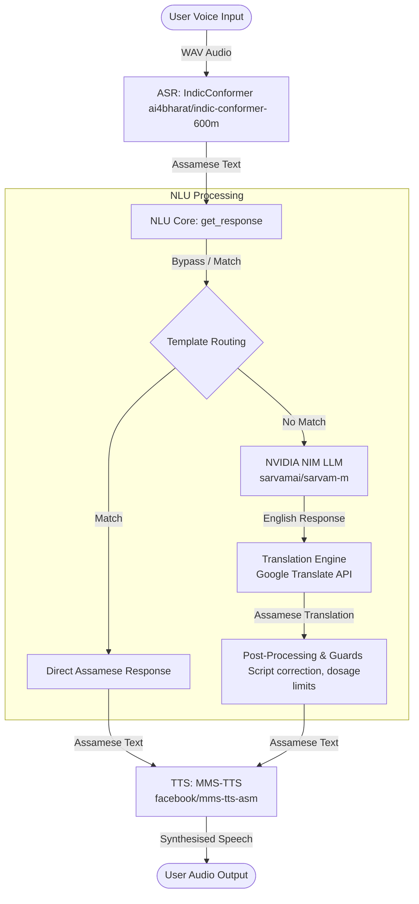

# Northeast Voice Assistant (Assamese Chatbot)

An end-to-end spoken dialogue system designed for healthcare and governance queries in Northeast India, focusing on the Assamese language. The system features a responsive Streamlit UI and integrates offline-first Automatic Speech Recognition (ASR), Large Language Model (LLM) NLU running on NVIDIA NIM, translation orchestration, and Text-to-Speech (TTS) synthesis.

---

## 🏗️ System Architecture

The chatbot runs on a cascading ASR ➔ NLU ➔ TTS pipeline:



---

## 📂 Repository Structure

The project is structured into modular components:

```
├── app/
│   ├── diagnostics/                 # Latency, sanity, and WER benchmark tests
│   │   ├── api_test.py              # Test NVIDIA NIM connections and models
│   │   ├── audit_samples.py         # Audit audio inputs for phoneme clarity
│   │   ├── run_fleurs_test.py       # Calculate Word Error Rate (WER) on FLEURS dataset
│   │   ├── run_live_test.py         # Evaluate off-template query handling
│   │   ├── run_pipeline_test.py     # E2E pipeline test on 15 pre-recorded samples
│   │   └── sanity_test_templates.py # Verify NLU template routing logic
│   ├── outputs/                     # Temporary and generated audio files
│   ├── test_audio/                  # Evaluation datasets and ground truth
│   ├── main.py                      # Pipeline orchestrator (ASR -> NLU -> TTS)
│   └── streamlit_app.py             # Premium, interactive Web UI
│
├── asr/
│   └── scripts/
│       └── asr_function.py          # ASR wrapper (IndicConformer Model)
│
├── nlu-mt/
│   ├── get_response.py              # NLU Routing, LLM queries, and Translation
│   └── requirements.txt             # NLU-specific package requirements
│
├── quantization/
│   ├── convert_to_onnx.py           # ONNX exporter using Optimum
│   ├── quantize.py                  # INT8 dynamic quantization script
│   └── benchmark.py                 # ONNX/Quantized model latency comparison
│
├── tts/
│   ├── outputs/                     # 15 domain sample audios (healthcare + governance)
│   └── scripts/
│       └── tts_function.py          # TTS wrapper (Meta MMS VITS Model)
│
├── Dockerfile                       # Cloud Run and containerization configuration
├── requirements.txt                 # Consolidated root package requirements
└── SETUP.md                         # Quick environment setup guide
```

---

## ⚙️ Local Setup & Installation

Follow these steps to run the pipeline locally:

### 1. Prerequisites
Ensure you have **Python 3.10+** installed.

### 2. Environment Setup
Create a virtual environment and activate it:
```bash
# Create
python -m venv .venv

# Activate (Windows)
.venv\Scripts\activate

# Activate (Mac/Linux)
source .venv/bin/activate
```

### 3. Install Dependencies
Install all package requirements using the consolidated root file:
```bash
pip install -r requirements.txt
```

### 4. Configure Credentials
1. Copy the example environment file:
   ```bash
   cp nlu-mt/.env.example nlu-mt/.env
   ```
2. Open `nlu-mt/.env` and add your **NVIDIA API Key**:
   ```ini
   NVIDIA_API_KEY=nvapi-your-key-here
   ```

### 5. Launch the Web App
Run the Streamlit application from the repository root:
```bash
streamlit run app/streamlit_app.py
```
> ⚠️ **Note:** On the first run, the app will automatically download the ASR and TTS model weights from Hugging Face (~2-3 GB). This requires a stable internet connection and may take a few minutes.

---

## 🔬 Diagnostics & Benchmarks

The `app/diagnostics/` folder contains comprehensive test suites to monitor performance:

*   **E2E Pipeline Test**: Runs the full cascade on all 15 demo audio samples.
    ```bash
    python app/diagnostics/run_pipeline_test.py
    ```
*   **ASR WER Evaluation**: Computes Character Error Rate (CER) and Word Error Rate (WER) against the Google FLEURS Assamese dataset.
    ```bash
    python app/diagnostics/run_fleurs_test.py
    ```
*   **Latency Benchmark**: Measures prompt response time on candidate LLMs.
    ```bash
    python app/diagnostics/run_normalized_fleurs_test.py
    ```

---

## ⚡ Model Quantization Pipeline

To optimize models for low-latency or on-device environments, the `quantization/` module exports models to ONNX and applies dynamic INT8 quantization:

1. **Export to ONNX**:
   ```bash
   python quantization/convert_to_onnx.py
   ```
2. **Quantize**:
   ```bash
   python quantization/quantize.py
   ```
3. **Benchmark Latency**:
   ```bash
   python quantization/benchmark.py
   ```

---

## 🚀 Deployment

The repository includes configuration to deploy the chatbot as a containerized service (e.g., Google Cloud Run) or a Hugging Face Space.

### Google Cloud Run
The root `Dockerfile` uses `python:3.10-slim` and sets up Streamlit on port `8080` (Cloud Run's default port):
```bash
# Build
docker build -t assamese-chatbot .

# Run locally
docker run -p 8080:8080 -e NVIDIA_API_KEY="your-key" assamese-chatbot
```